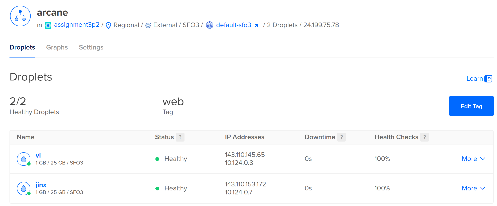
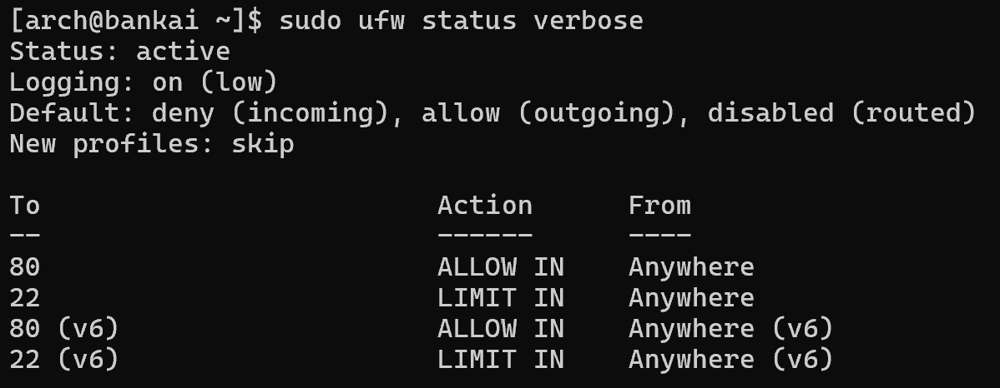
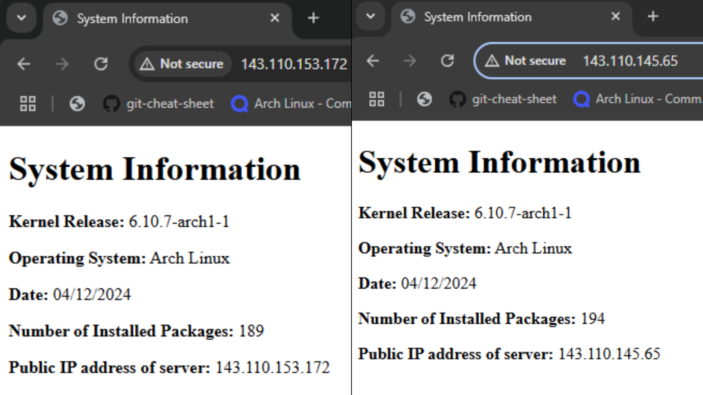
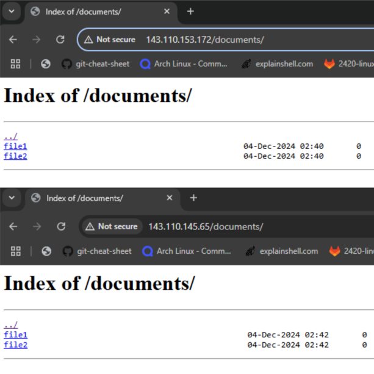
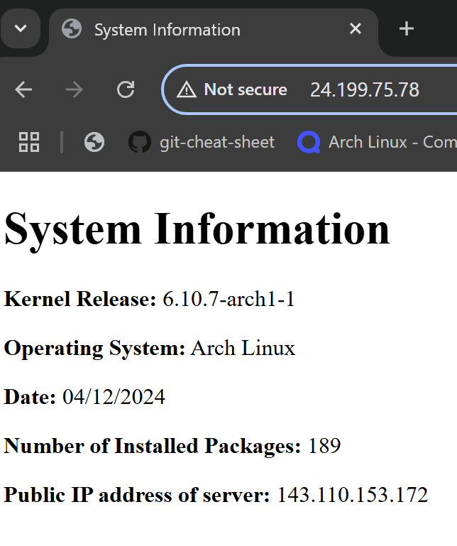

## Introduction
Welcome to my Bash scripting project! This guide will walk you on how to generate a static `index.html` file containing your system's information. The script will be scheduled to run daily at 05:00 using a `systemd` service and timer. The generated HTML file will be served by an nginx web server, with  security provided by a firewall configured using `ufw`. Additionally, we will set up two servers and integrate them with a load balancer to optimize traffic distribution.

---
## Prerequisites
To get started, please ensure you meet the following requirements:
- **Droplets**:  Previous experience with creating droplets is recommended, if you're not familiar, please refer to:
	- [How to Create a Droplet](https://docs.digitalocean.com/products/droplets/how-to/create/)
- **Operating System**: The latest version of Arch Linux with Bash.
	- If not, please run the following commands:
	- `sudo pacman -Syu`
	- `sudo pacman -S archlinux-keyring && sudo pacman -Syu`
- **Permissions**: Root access to execute the scripts.
- **Directory**: All commands in this guide is run in the users home directory.
- **Packages Installed**: `nginx` and `ufw`
- **Cloned Repository**: Clone this repository to your system.
	- `git clone https://github.com/lillixnvu/assignment3p2`

---
## Create Droplets and Load Balancer
1. Open DigitalOcean
2. Create two new droplets
3. In those two droplets, ensure you have included a tag "web"
4. Load Balancer Settings
	- **Choose a Load Balancer type**: Regional
	- **Choose a datacenter region**: Choose the closest to you (e.g., in my case it would be San Francisco 3)
	- **Network Visibility**: External (Public)
	- **Choose a name**: Name of your choice
5. Create Load Balancer

**Output**:


>[!NOTE]
>**So, what is a load balancer?** A load balancer is a system is used to distribute incoming network traffic across multiple servers (two or more) to ensure optimal resource usage, high availability, and improved performance. It prevents server overload, reroutes traffic is a server fails, and enhances application reliability.
>

---
## Setting up the System User and Directory Structure 
1. Run the following command to create a system user with a home directory in `/var/lib/webgen` with a non-login shell:
```bash
sudo useradd -r -d /var/lib/webgen -s /usr/sbin/nologin webgen
```
#### What does this command do?
`useradd`: Command to add a new user to the system.
`-r`:  Creates a system user 
`-d /var/lib/webgen`:  Specifies the home directory for the user as `var/lib/webgen`
`-s /usr/sbin/nologin`: Sets the user's shell to prevent the user from logging into the system interactively
`webgen`: The name of the user being created

>[!NOTE]
>**What is the benefit of creating a system user for this task rather than using a regular user or root?**
>Using a system user enhances security by limiting privileges and preventing interactive logins, reducing risks compared to using a regular user or root. It isolates processes, simplifies monitoring, and ensures tasks have only the access they need. This approach minimizes potential damage and ensures a more secure, maintainable system.


2. Create the home directory structure:
```bash
sudo mkdir -p /var/lib/webgen/bin /var/lib/webgen/HTML /var/lib/webgen/documents
```

3.  Copy the `generate_index` script into the `/var/lib/webgen/bin` folder:
```bash
sudo cp /home/user/assignment3p2/2420-as3-p2-start/generate_index /var/lib/webgen/bin
```
>[!NOTE] 
>Please replace **user** with your actual **username**!

4. Give ownership to `webgen` and make `generate_index` executable:
```bash
sudo chown -R webgen:webgen /var/lib/webgen
sudo chmod u+x,g+x /var/lib/webgen/bin/generate_index
```

5. Make files in your documents.
```bash
sudo touch /var/lib/webgen/documents/file1 /var/lib/webgen/documents/file2
```
---
## Setting up `.timer` and `.service` for `generate_index`

1. Copy the files provided `generate_index.timer` and `generate_index.service` to `/etc/systemd/system`
```bash
sudo cp /home/user/assignment3p2/generate_index.{service,timer} /etc/systemd/system
```
>[!NOTE] 
>Please replace **user** with your actual **username**!

2. Reload `systemd` after the changes:
```bash
sudo systemctl daemon-reload
```

3. Enable and start the timer:
```bash
sudo systemctl enable generate_index.timer
sudo systemctl start generate_index.timer
```

4. Verify that `.timer` and `.service` is running successfully:
```bash
# Check when the timer will run next:
systemctl list-timers --all | grep generate_index.timer

# Check if the service ran successfully:
sudo systemctl status generate_index.service

# View logs for service:
journalctl -u generate_index.service

# View logs for timer:
journalctl -u generate_index.timer

# Manually start your service:
sudo systemctl start generate_index.service
```
### What does `generate_index.timer` do?
The `.timer` file is used in relation with a `.service` file in `systemd` to schedule and trigger a specific service at a specific time. The whole purpose is to run the `generate_index.service` at a specified time.
```bash
[Unit]
# Brief description of the timer's purpose
Description=Run the gengerate_index.service at 05:00

[Timer]
# Specifies when the timer will trigger
# *-*-* means "every year, every month, every day" 
# 05:00:00 means it will run at 05:00AM in 24-hour format
OnCalendar=*-*-* 05:00:00
# Ensures the timer will "catch up" missed run if the system is powered off or the timer wasn't active when the schedule time passed.
Persistent=true

[Install]
# Ensures the timer is started when the timer.target (systemd target that manages timers) is active
WantedBy=timers.target
```

### What does `generate_index.service` do?
The `generate_index.service` file runs a script to generate a website's `index.html` as the webgen user, ensuring that the network is fully initialized before execution.

```bash
[Unit]
Description=Generate index for website
# Ensures that the service starts only after the network is fully online
After=network-online.target
# Request that the network-online target is activated but doesn't fail if it's not available
Wants=network-online.target

[Service]
# Specifies the specific user
User=webgen
# Specifies the specific group
Group=webgen
# Indicates that the service performs a single task and then exits
Type=oneshot
# Indicates where to run the script
ExecStart=/var/lib/webgen/bin/generate_index
# Configures the service to restart if it fails  
Restart=on-failure

[Install]
# Specifies that the service should be activated when the system reaches the multi-user.target
WantedBy=multi-user.target  
```

---
## Setting Up `nginx`
1. Copy your `nginx.conf`  from `/home/user/assignment3p2` to `/etc/nginx`
```bash
sudo cp /home/user/assignment3p2/nginx.conf /etc/nginx
```

2. Create a directory for the server block:
```bash
sudo mkdir -p /etc/nginx/sites-available /etc/nginx/sites-enabled
```

3. Copy the file `default.conf` to `/etc/nginx/sites-available`:
```bash
sudo cp /home/user/assignment3p2/default.conf /etc/nginx/sites-available
```
>[!NOTE] 
>Please replace **user** with your actual **username**!

4. Create a symbolic link:
```bash
sudo ln -s /etc/nginx/sites-available/default.conf /etc/nginx/sites-enabled/default.conf
```

5. Start and enable `nginx`:
```bash
sudo systemctl start nginx
sudo systemctl enable nginx
```

6. Check the status of the `nginx` services and test your `nginx` configuration:
```bash
# Check status and verify if it's running
sudo systemctl status nginx

# Check any errors in the nginx configuration
sudo nginx -t

# Apply any changes you've made to the configuration
sudo systemctl reload nginx
```

>[!NOTE]
> **Why is it important to use a separate server block file instead of modifying the main `nginx.conf` file?**
> > Using a separate server block keeps configurations organized and easy to manage. IT reduces errors, simplifies troubleshooting, and makes backups and scaling easier compared to editing the main `nginx.conf` file.

### What is in `nginx.conf`?
This file is the main configuration file for the `nginx` web server. It contains directives for how `nginx` should run, handle network connections, and serve content. 
```bash
# Specifies the user under which nginx worker processes will run
user webgen;
# Auto adjust the number of worker processes based on availability
worker_processes auto;
# Binds worker processes to specific CPU cores for better performance
worker_cpu_affinity auto;

events {
    multi_accept on;
    worker_connections 1024;
}

# Configuration for handling HTTP requests and responses
http {
    charset utf-8;
    sendfile on;
    tcp_nopush on;
    tcp_nodelay on;
    server_tokens off;
    log_not_found off;
    types_hash_max_size 4096;
    client_max_body_size 16M;

    # MIME
    include mime.types;
    default_type application/octet-stream;

    # logging
    access_log /var/log/nginx/access.log;
    error_log /var/log/nginx/error.log warn;

    # load configs
    include /etc/nginx/conf.d/*.conf;
    include /etc/nginx/sites-enabled/*;
}
```
### What is in `default.conf`?
```bash
server {
    # Listens on IPv4 for incoming HTTP connections on port 80
    listen 80;
    # Listens on IPv6 for incoming HTTP connection on port 80
    listen [::]:80;
    
    # Default server block where _ matches all domain names
    server_name _;
    
    # Sets the root directory for the web server's HTML
    root /var/lib/webgen/HTML/;
    # Specifies the default file to serve when accessing the root directory
    index index.html;
    # Location block for the root directory
	location / {
        try_files $uri $uri/ =404;
    }

    # Sets up the '/documents' directory
    location /documents { 
        # Sets the root directory to '/var/lib/webgen'
        root /var/lib/webgen;       
        autoindex on;                # Enables the directory listing
        autoindex_exact_size off;    # Shows file sizes, human-readable
        autoindex_localtime on;      # Displays file timestamps
    }


}
```
---
## Setting up `ufw`
1.  Enable and start the `ufw.service`:
```bash
sudo systemctl enable --now ufw.service
```
>[!Note]
>You may need to reboot your system before proceeding, please run the command `sudo reboot`

2. Allow SSH connection and limit the rate to our firewall:
```bash
sudo ufw allow ssh
sudo ufw limit ssh
```

3. Allow http connections:
```bash
sudo ufw allow http
```

4. Once set-up, run the following:
```bash
sudo ufw enable
```

5. Check the status to confirm that everything is working:
```bash
sudo ufw status verbose
```

**Output**:


---
## Check Servers, Documents and Load Balancer
To check if your both web server is running, please go to any web browser and enter in `http://please-input-your-ip-address`

**Servers**


**Documents**


**Load Balancer**
